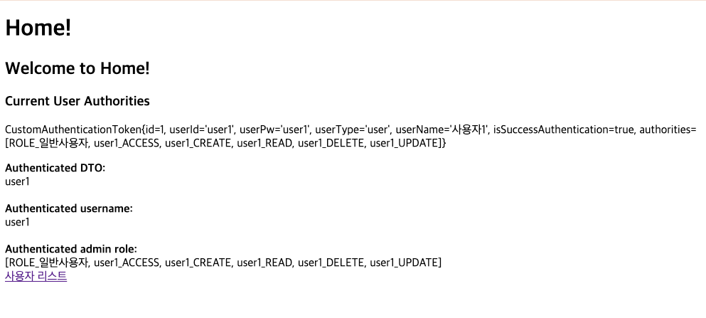
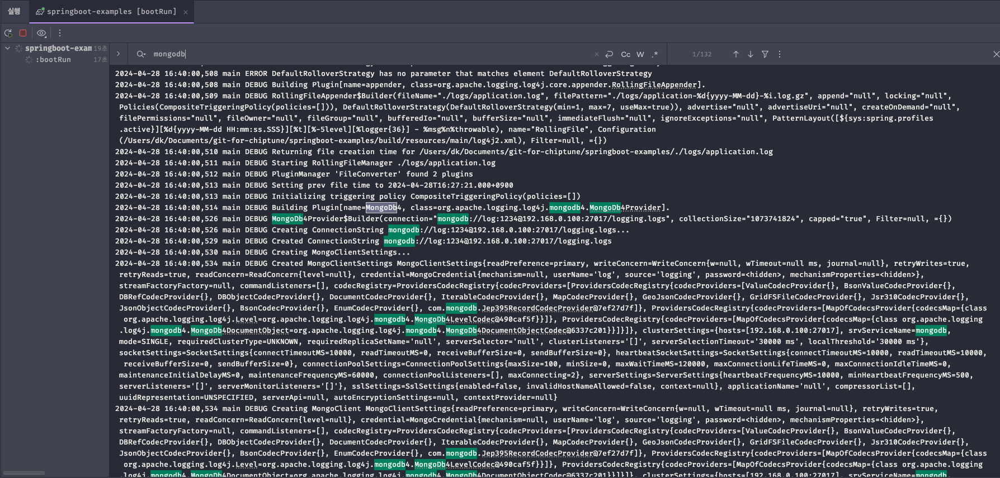
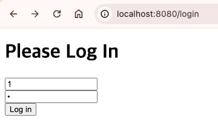
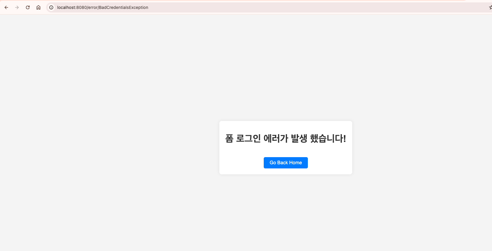
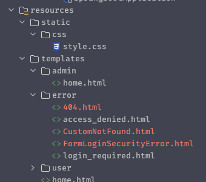
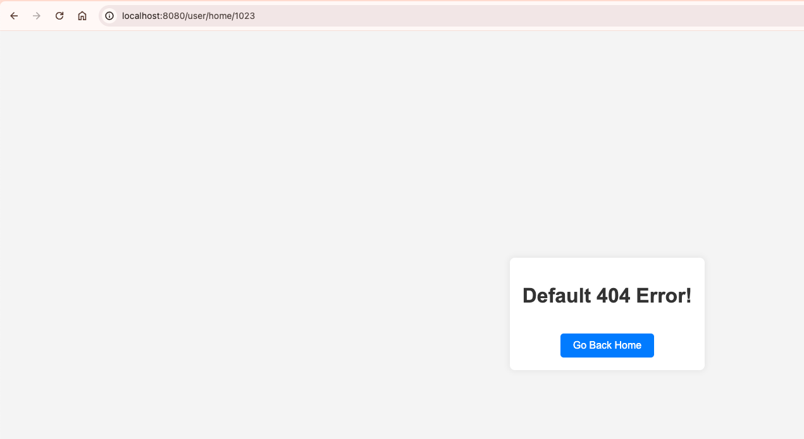
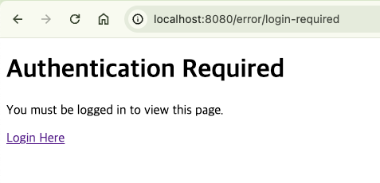

## Security Error Handling

이전 글에서 이어집니다.

[https://chiptune93.github.io/backend/spring/spring-security-pratice3.html](https://chiptune93.github.io/backend/spring/spring-security-pratice3.html)

### 스프링 시큐리티에서의 에러 처리

스프링 시큐리티에서 에러를 처리하는 방법은 부트에서 보통 처리하는 `@ControllerAdvice` 와 같은 전역 에처처리로는 불가능하다.

왜냐하면, 스프링 시큐리티는 필터 체인 방식으로 인증 요청을 검사한다. 당연하게도 필터는 애플리케이션에 요청이 들어가기 전에 동작한다.

그래서 일반적인 에러 처리로는 처리가 불가능하고 시큐리티에서 제공하는 에러 처리 방식을 따라야 한다.

### AccessDeniedHandler 와 AuthenticationEntryPoint

AuthenticationEntryPoint와 AccessDeniedHandler는 스프링 시큐리티에서 인증 및 권한 부여 과정에서 중요한 역할을 한다. 그러나 그 역할과 사용 시점에 차이가 있다. 두 인터페이스는 접근 제어 과정에서 발생할 수 있는 다른 종류의 보안 예외를 처리한다.

#### AuthenticationEntryPoint

##### 목적

AuthenticationEntryPoint는 인증되지 않은 사용자(즉, 사용자가 로그인하지 않은 상태)가 보호된 리소스에 접근하려고 할 때 호출된다. 이 인터페이스는 인증 과정이 수행되어야 할 때 사용자에게 인증을 요구하는 방식을 제어한다.

##### 사용 시점

사용자가 인증되지 않은 상태에서 보호된 리소스에 접근할 때이다. 예를 들어, 세션이 만료되었거나 아직 로그인하지 않은 사용자가 로그인이 필요한 페이지에 접근하려고 하는 경우에 AuthenticationEntryPoint가 작동한다.

#### AccessDeniedHandler

##### 목적

AccessDeniedHandler는 사용자가 인증은 되었지만, 해당 요청을 수행할 권한이 없는 경우(즉, 필요한 권한이 부족할 때)에 사용된다. 이 인터페이스는 권한이 없는 사용자가 보호된 리소스에 접근하려고 할 때 권한 부족을 처리하는 방식을 제어한다.

##### 사용 시점

사용자가 인증은 되었지만, 그 사용자에게 특정 리소스에 대한 접근 권한이 없을 때이다. 예를 들어, 일반 사용자가 관리자 전용 페이지에 접근하려고 시도할 때 AccessDeniedHandler가 작동한다.

    
간단히 말해서, AuthenticationEntryPoint는 "인증이 필요하다"를 처리하고, AccessDeniedHandler는 "당신은 이 작업을 수행할 권한이 없다"를 처리한다. 각각은 스프링 시큐리티에서 보안과 관련된 특정 시나리오에 대해 적절한 사용자 피드백과 리디렉션을 제공하기 위해 필수적이다.

### 인가 처리를 위한 권한 설정 세팅하기

간단하게 기존에 되어있지 않던 권한을 세팅하기 위해 아래와 같이 세팅했다.

#### 권한 타입 추가

- AuthType : 권한 Enum 클래스

```java
package dev.chiptune.springboot.entity;

public enum AuthType {
    USER, ADMIN, ALL;

    public String getName() {
        return this.name();
    }
}
```

- Users : 권한 컬럼을 추가

```java
@Entity
@Getter
@Setter
@ToString
public class Users {
    @Id
    @GeneratedValue(strategy = GenerationType.IDENTITY)
    private Long id;
    private String username;
    private String email;
    private String password;
    @Enumerated(EnumType.STRING)
    private AuthType authType;
}
```

- CustomUserDetails
  - 권한 항목을 추가하고, 권한이 1:N으로 떨어지는 상활까지 가정하여 리스트 형태로 선언했다.
  - 여기서는 임시(테스트) 목적이기 때문에 'ALL'이 저장된 데이터는 2가지 권한을 갖도록 했다.

```java
public class CustomUserDetails implements UserDetails {

    Long id;
    String username;
    String email;
    String password;
    // 권한 추가
    List<AuthType> auth = new ArrayList<>();

    public CustomUserDetails(Users users) {
        System.out.println(users.toString());
        this.id = users.getId();
        this.username = users.getUsername();
        this.email = users.getEmail();
        this.password = users.getPassword();
        // 1:N이 될 수 있어 ALL인 경우 2가지 권한을 다 갖도록 설정.
        if (users.getAuthType() == AuthType.ALL) {
            this.auth.add(AuthType.USER);
            this.auth.add(AuthType.ADMIN);
        } else {
            this.auth.add(users.getAuthType());
        }
    }

    @Override
    public Collection<? extends GrantedAuthority> getAuthorities() {
        return auth.stream().map(role -> new SimpleGrantedAuthority(role.getName())).collect(Collectors.toList());
    }
    // ...
    // ...
}
```

#### 타입에 따른 시큐리티 설정 추가

- 컨트롤러에 admin과 user 하위 URL 추가

```java
@GetMapping("/admin/home")
    String adminHome(Model model) {
        model.addAttribute("data", usersService.findAllUsers());
        return "/admin/home";
    }

    @GetMapping("/user/home")
    String userHome(Model model) {
        model.addAttribute("data", usersService.findAllUsers());
        return "/user/home";
    }
```

- Security Config에 각 권한에 맞는 접근 권한 설정

```java
.authorizeHttpRequests(authz -> authz
.antMatchers("/admin/**").hasAnyAuthority("ADMIN") // ADMIN 권한이 있으면 가능
.antMatchers("/user/**").hasAnyAuthority("USER") // USER 권한이 있으면 가능
.requestMatchers(new AntPathRequestMatcher("/sample")).permitAll() // "/sample" 경로에 대해서는 인증 없이 접근을 허용합니다.
.requestMatchers(new AntPathRequestMatcher("/login")).permitAll() // "/login" 경로에 대해서도 인증 없이 접근을 허용합니다.
.requestMatchers(new AntPathRequestMatcher("/h2-console/**")).permitAll() // "/h2-console/**" 경로에 대해서도 인증 없이 접근을 허용합니다.
.anyRequest().authenticated() // 위에 정의된 경로를 제외한 모든 요청에 대해서는 인증을 요구합니다.
```

> 인증 부분은 예제의 아래 소스를 참고하세요!

- CustomAuthenticationProvider
- CustomAuthenticationToken

### 권한을 추가한 상태에서 로그인 시도해보기

- Admin으로 로그인



- SuccessHandler에 의해 권한에 맞는 Home으로 이동한 모습.



- 여기서 /user/home으로 권한 없는 URL로 접근 시도를 하면?



- 403 에러가 발생한다!



### 인증과 인가 과정에서의 에러처리를 담당할 클래스를 생성하고 지정하기.

에러가 발생하면 페이지로 보내기 위해 컨트롤러를 우선 생성한다.

```java
package dev.chiptune.springboot.controller;

import org.springframework.stereotype.Controller;
import org.springframework.ui.Model;
import org.springframework.web.bind.annotation.GetMapping;
import org.springframework.web.bind.annotation.RequestMapping;

@Controller
@RequestMapping("/error")
public class ErrorPageController {
    @GetMapping("/login-required")
    public String loginRequired(Model model) {
        return "/error/login_required";
    }

    @GetMapping("/access-denied")
    public String accessDenied(Model model) {
        return "/error/access_denied";
    }
}
```

#### AccessDeniedHandler 생성

- 권한 없음 에러 발생 시, 우리가 보내고자 하는 페이지로 리다이렉트 한다.

```java

public class CustomAccessDeniedHandler implements AccessDeniedHandler {

    @Override
    public void handle(HttpServletRequest request, HttpServletResponse response, AccessDeniedException accessDeniedException) throws IOException {
        // 주석 부분은 단순히 에러 응답만 보낸다.
        // response.sendError(HttpServletResponse.SC_FORBIDDEN, "커스텀 액세스 핸들링! 권한이 없습니다!");
        response.sendRedirect("/error/access-denied");
    }
}
```

#### AuthenticationEntryPoint 생성

- 인증 과정에서 오류 발생 시, 우리가 보내고자 하는 페이지로 리다이렉트 한다.

```java

public class CustomAuthenticationEntryPoint implements AuthenticationEntryPoint {

    @Override
    public void commence(HttpServletRequest request, HttpServletResponse response, AuthenticationException authException) throws IOException {
        // 주석 부분은 단순히 에러 응답만 보낸다.
        // response.sendError(HttpServletResponse.SC_UNAUTHORIZED, "커스텀 에러 핸들링! 인증이 필요합니다!");
        response.sendRedirect("/error/login-required");
    }
}
```

#### FilterChain 에 Error Handling 등록

- Security Config 내 filterChain에 핸들러들을 등록한다.

```java
...
// 에러 핸들링을 구성한다.
.exceptionHandling()
.authenticationEntryPoint(new CustomAuthenticationEntryPoint())
.accessDeniedHandler(new CustomAccessDeniedHandler())
...
```

### 에러 핸들링 추가 후, 확인해보기

#### AccessDenied 확인.

- 아까와 같이 admin으로 로그인 후, user 경로에 접근을 시도한다.



- AccesDenied 페이지로 이동한다.



#### AuthenticationEntryPoint 확인.

- 인증이 없는 상태에서 인증이 필요한 URL에 접근해본다.



- 인증 필요 페이지로 이동하는 것을 확인할 수 있다. 

### 결론

시큐리티에서 에러를 처리하는 방법에 대해 알아보았다.
실제로 시큐리티 인증 처리과정에서 발생하는 다양한 오류는 더 처리를 해야 한다.

위 2가지는 기본적인 리소스 보호 및 권한 체크 상황에서의 기본적인 오류 처리를 하고 있다.
실제 인증 과정에서 로직에 오류가 발생하는 경우, throw를 통해 에러를 던져서 `@ControllerAdvice` 에서 처리가 가능하다.

다음에는 시큐리티 기본 에러 처리와 함께 어떤 에러가 발생하더라도 에러 페이지로 리다이렉트 되도록 전체적으로 에러 처리를 하는 방법을 알아보고자 한다.

해당 예제 소스는 여기서 확인 하실 수 있습니다.

[https://github.com/Chiptune93/springboot.java.example/tree/feature/spring-security/security-error-handling](https://github.com/Chiptune93/springboot.java.example/tree/feature/spring-security/security-error-handling)
